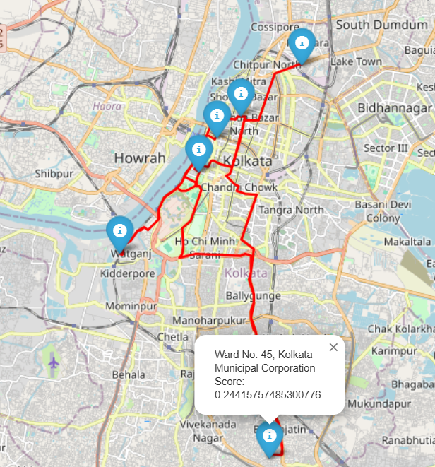

# Shortest Path Optimization for Waste Collection in Kolkata Wards

This Python program calculates the optimal waste collection route in Kolkata based on the population-to-waste generation ratio across 144 wards. The program analyzes data on population density and waste generation per ward to find the shortest path that maximizes efficiency for waste collection services.

## Assumptions

As there are no available sources for 'Kolkata's waste generation by wards', I assumed that the average waste generation per person in India would be nearly uniform, with minimal variance. I used census data and Indian state-level waste generation data to fine-tune a regression model. This model was then extrapolated to estimate the waste generated by each ward in Kolkata, allowing for a more informed route optimization.


## Features

- **Ward-Level Analysis**: Incorporates data from 144 wards of Kolkata.
- **Population-Waste Ratio**: Prioritizes wards based on a weighted score of population and waste generated to optimize collection routes.
- **Shortest Path Calculation**: Uses graph-based algorithms to compute the most efficient routes.
- **Integration with Google Maps API**: Visualizes routes on a map with real road networks.
- **Customizable Parameters**: Allows adjustments to weightings between population and waste factors.

## Prerequisites

- Python 3.x
- Google Maps API Key
- Libraries:
  - `numpy`
  - `pandas`
  - `geopy`
  - `networkx`
  - `matplotlib`
  - `googlemaps`

Install dependencies via `pip`:

```bash
pip install geopy folium networkx ortools requests polyline googlemaps polyline
```

## Data Sources
- Population Data: Population per ward is scraped from [Wikipedia](https://en.wikipedia.org/wiki/Administrative_divisions_of_Kolkata) Kolkata into the [kolkata_wards.csv](./kolkata_wards.csv) file.
- Waste Generation Data: Using the regression model trained on Indian state waste data, the waste generated per ward is extrapolated onto the kolkata wards csv file.


## Algorithm
The program leverages Dijkstra's algorithm from the networkx library to compute the shortest path between wards. The rank/priority for each node (ward) are determined by the ratio of population to waste generated.

The heart of the optimization process is ranking the wards based on a combined score of waste generation and population, inspired by the **Knapsack problem** but adapted for this specific use case.
The formula assigns different weights to waste and population to prioritize areas that generate more waste. Here's a simplified breakdown:

1. **Normalize the Data**: Both the population and waste generation values are normalized to a scale of 0 to 1. This ensures that both factors are comparable, despite having different units.

2. **Weighted Scoring**: Each ward is given a score based on the following formula:
   ```python
   Score = (Weight of Waste * Normalized Waste) + (Weight of Population * Normalized Population)
   ```
In this case, the weightings can be adjusted based on priorities. For example:

If waste is more important, set Weight of Waste = 0.7 and Weight of Population = 0.3.
Ward Ranking: Wards are ranked based on their scores, with higher scores indicating higher priority for waste collection services.   

## Output
Route Visualization: A map is generated showing the shortest path between the selected wards.



Route Details: The program outputs a step-by-step breakdown of the route, including distances between wards and estimated collection times.

## Future Improvements
- Integration with live traffic data to further optimize routes.
- Addition of waste collection vehicle capacity constraints.
- Real-time data integration for dynamic routing adjustments.
- Interconnection between the vehicles. 

## Acknowledgements
Population and waste data sourced from official Kolkata Municipal Corporation reports and extrapolated using Indian state waste generation data.
Google Maps API for route visualization.
